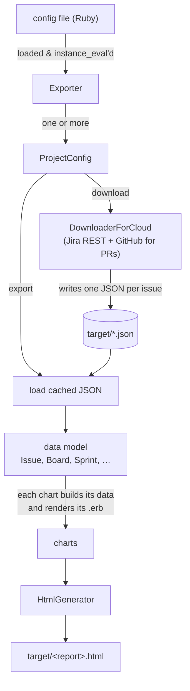

JiraMetrics is hosted on Github, as is the source for this documentation site. We accept PR's for both.

* [JiraMetrics](https://github.com/mikebowler/jirametrics)
* [Documentation](https://github.com/mikebowler/jekyll_jirametrics)

If you're new to the codebase, the [How the code is organized](#how-the-code-is-organized) section below is the fastest way to get your bearings before you start reading source.

# Getting set up

Once you have downloaded the [source from github](https://github.com/mikebowler/jirametrics), you'll want to go to the root of that folder and run `bundle install` from the terminal to install all the ruby dependencies.

Then run `npm install` to install the javascript dependencies. Javascript? Yes, we have one file of Javascript functions that are used by the final report, and we have to have some way to run unit tests for that.

# How the code is organized

This section is a map, not a manual. It's here to give you a sense of how the pieces fit together and where to start looking — the details you'll pick up faster by reading the code itself.

## What it does, in one sentence

JiraMetrics downloads the history of your Jira issues, builds a model of what happened to each one, and renders a set of agile-metrics charts (cycle time, aging work, WIP, throughput, and so on) into a single self-contained HTML report.

## The pipeline

Everything is a straight line from a config file to an HTML report. There are two halves — **download** and **export** — and they meet at a folder full of cached JSON.

The two halves are deliberately separate. **Download hits the network and writes JSON to the target folder; export only ever reads that folder.** So once you've downloaded, you can iterate on charts all day against cached data without touching Jira. `go` just runs one then the other.

## The parts, and where to start looking

**CLI — `lib/jirametrics.rb`** (plus `bin/jirametrics`, `bin/jirametrics-mcp`). A [Thor](https://github.com/rails/thor) command class. The commands are `download`, `export`, `go` (both), `info` (dump one issue), and `mcp`. Every command loads the config, then delegates to `Exporter.instance`.

**Config DSL — `exporter.rb`, `project_config.rb`, and the `*_config.rb` family.** The config file is not YAML — it's Ruby, `instance_eval`'d, so a config can contain real logic. `Exporter.configure` builds an `Exporter` holding one or more `ProjectConfig`s; each project has a `DownloadConfig` and one or more output files (`FileConfig`). An HTML output file carries an `HtmlReportConfig`, which is what actually declares the charts (a CSV file declares columns instead). The user-facing side of this DSL is documented under [Configuration](); the classes above are where it lives.

**Download — `downloader.rb`, `downloader_for_cloud.rb`, `jira_gateway.rb`, `github_gateway.rb`.** `Downloader.create` is a small factory that picks the right downloader for the project; `downloader.run` then pulls boards, issues, changelogs, sprints, and (optionally) linked GitHub pull requests through the gateways, writing one JSON file per issue into the target folder. `downloader_for_data_center.rb` is the **deprecated** Data Centre path — `downloader_for_cloud.rb` is where new work goes.

**Data model — `issue.rb` is the heart.** On export, each cached JSON file becomes an `Issue`, whose history is a list of `ChangeItem`s (`change_item.rb`). Around it sit `Board` (with `BoardColumn`, `Status`), `Sprint`, `IssueLink`, and `PullRequest`. The single most important collaborator is **`cycle_time_config.rb`** — configured per board with `start_at`/`stop_at` blocks, it decides when each issue *started* and *stopped* and therefore its cycle time. Most charts are ultimately asking that engine a question.

**Charts — `chart_base.rb` and its ~30 subclasses.** A chart is two files: a Ruby class (`lib/jirametrics/<chart>.rb`) that assembles the data in `#run`, and a matching ERB template (`lib/jirametrics/html/<chart>.erb`) that draws it. `wrap_and_render(binding, __FILE__)` in `ChartBase` ties the two together. Shared behaviour lives in bases and mixins: `TimeBasedChart` / `TimeBasedScatterplot` / `TimeBasedHistogram`, and the `GroupableIssueChart` mixin with its `grouping_rules`.

**Report assembly — `html_report_config.rb`, `html_generator.rb`.** The report config collects the rendered charts; `HtmlGenerator#create_html` wraps them in `index.erb` and writes the final, self-contained HTML file. No external assets at view time — CSS and JS are inlined.

**MCP server — `mcp_server.rb`** (`bin/jirametrics-mcp`, or `jirametrics mcp`). Exposes the same data model to an AI assistant over the [Model Context Protocol]() instead of rendering charts.

**Anonymizer — `anonymizer.rb`.** Scrubs keys, titles, names, boards, sprints, and the server URL out of a loaded data set so a report or export can be shared without leaking client data.

## Conventions worth knowing

- **All file I/O goes through `FileSystem` (`file_system.rb`), which is injected.** Nothing calls `File.read` directly; tests pass a `MockFileSystem`. If you're adding code that touches disk, take a `file_system` and use it.
- **Config is executable Ruby.** Powerful, but it means a config can do anything — treat one you didn't write as untrusted.
- **Export is offline.** If a chart needs a piece of data, that data has to have been downloaded and cached. Reaching for the network during export is the wrong layer.
- **Times are localized once, at parse.** `Issue#parse_time` applies the configured `timezone_offset` when it reads history, so most downstream date math is already in the right zone — you rarely re-apply it.

## Where do I look when I want to…

| I want to… | Start here |
|:--|:--|
| Understand a whole run end-to-end | `lib/jirametrics.rb` → `exporter.rb` → `project_config.rb#run` |
| Add or change a chart | a new `ChartBase` subclass + its `html/<name>.erb` template |
| Change what counts as cycle-time start/stop | the board's `cycletime` block → `cycle_time_config.rb` |
| Change how issue history is parsed | `issue.rb` (`load_history_into_changes`, `parse_time`), `change_item.rb` |
| Add a config option | the relevant `*_config.rb` (e.g. `html_report_config.rb`, `project_config.rb`) |
| Change what/how we download | `downloader_for_cloud.rb`, `jira_gateway.rb`, `github_gateway.rb` |
| Work on the MCP tools | `mcp_server.rb` |
| Understand blocked/stalled or WIP metrics | `blocked_stalled_change_stream_builder.rb`, `board_movement_calculator.rb` |

# Running it during development

Most of the individual commands that you would call on JiraMetrics itself, can be run through `rake` so that you don't have to package and install the gem just to test some new code. The supported commands are `go`, `download`, and `export`

For example, when all the source is downloaded, `rake export` will do the same as `jirametrics export`. You will get a warning about how you should have called it through the gem but you can ignore that if you're doing development.

# Testing

We do expect that all new code will have tests, unless there's a really good reason to skip them. Yes, we're aware that the existing codebase doesn't have 100% coverage. We're making a point of continually improving that coverage number though.

Specs live in `spec/`, one per class. Because `FileSystem` is injected everywhere (nothing reads the disk directly), most tests build their data in memory or from small JSON fixtures under `spec/` rather than hitting Jira or the disk — so they stay fast and deterministic.

To run the tests, `rake spec` runs the Ruby specs, and `rake test` runs those _plus_ the JavaScript tests (for the report's one JS file, mentioned above). The two names also happen to indulge fingers that sometimes want to type _spec_ and sometimes _test_ — but they aren't identical, so reach for `rake test` when you've touched the JavaScript.

Also the command `rake focus` will run only the tests that have the `:focus` tag on them. It's often convenient to only run one test at a time, if we're trying to debug something.

# Linting

We use [RuboCop](https://rubocop.org) as our linter and there are [rubocop rules](https://github.com/mikebowler/jirametrics/blob/main/.rubocop.yml) in the project. Please ensure that your changes run with no rubocop warnings as that just makes it easier for the committers. The config is deliberately tuned and any `rubocop:disable`s in the code are there on purpose, so match the surrounding style rather than fighting the linter.

Run it from the terminal with `rubocop` or integrate it into your source editor.

# The documentation website

Once you have downloaded the [source from github](https://github.com/mikebowler/jekyll_jirametrics), you'll want to go to the root of that folder and run `bundle install` from the terminal to install all dependencies.

This is a static website built with [Jekyll](https://jekyllrb.com) so familiarizing yourself with that tool will be helpful.

It unfortunately uses a custom theme that you'll also need to [download from github](https://github.com/mikebowler/so-simple-theme). This a forked copy of a formally published theme and the plan was always to push changes back upstream but that project no longer seems to accept PR's so we're stuck with our own custom version.

The command `rake server` will spin up a server on port 4000 that you can access with http://localhost:4000
